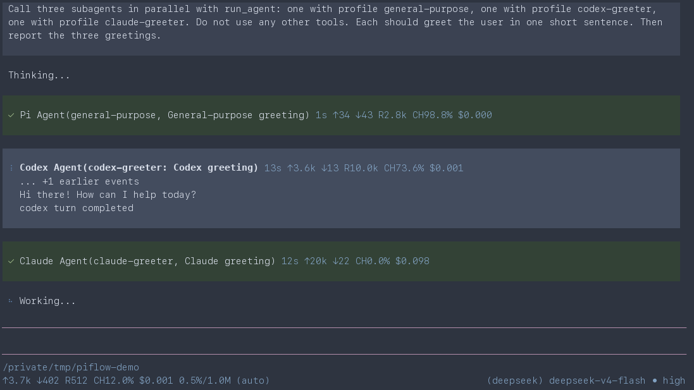
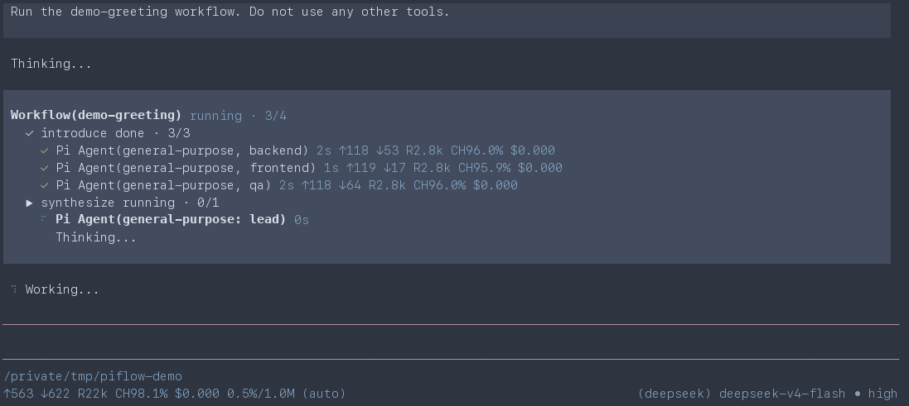

<div align="center">

# pi-flow

**Give Pi a team.**

Orchestrate subagents and multi-step workflows across **Pi**, **Codex CLI**, and **Claude Code** without leaving your Pi session.

[](https://github.com/kky42/pi-flow/actions/workflows/ci.yml)
[](./LICENSE)

</div>

## One coordinator, focused subagents

Define subagents for **Pi**, **Codex CLI**, and **Claude Code**, then orchestrate them from one Pi session - a few parallel `run_agent` calls or a staged `run_workflow` with live progress.

| Primitive | Use it for |
| --- | --- |
| **`run_agent`** | One focused, resumable subagent or several independent subagents in parallel. |
| **`run_workflow`** | Parallel or staged subagents, branching, structured results, and saved orchestration. |

<p align="center">
  
  
</p>

## Try it

```bash
pi install npm:@kky42/pi-flow
```

Ask Pi naturally:

```text
Use three subagents in parallel to review architecture, tests, and documentation, then synthesize their findings.
```

```text
Use a workflow to classify each changed file by risk, run the matching review, and return structured results.
```

The active Tool row shows queued and running work. Pi receives the final Tool result after the direct subagent or outer workflow finishes.

### Add simple subagents

Profiles live at `~/.pi/agent/subagents/<name>.md`. The filename becomes the profile name. Codex and Claude profiles bypass their native permission prompts, so use them only in trusted repositories.

**Pi explorer**

```md
---
description: Fast read-only repository explorer.
model: deepseek/deepseek-v4-flash
thinking: high
---
Map the repository and return the important paths.
```

**Codex reviewer**

```md
---
description: Reviews code for correctness and missed edge cases.
backend: codex
model: gpt-5.6-luna
thinking: high
---
Review the current diff and lead with concrete findings.
```

**Claude UI reviewer**

```md
---
description: Reviews UI quality and accessibility.
backend: claude
model: claude-sonnet-4-5
thinking: high
---
Inspect the UI and recommend specific improvements.
```

## License

[MIT](./LICENSE)
